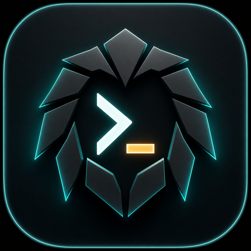
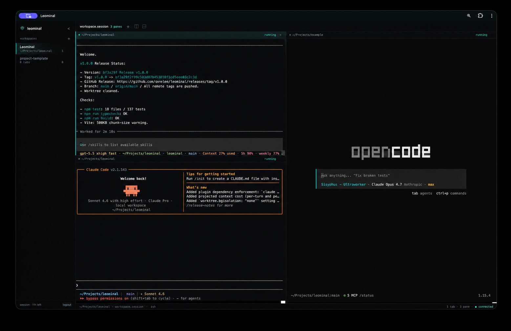

# Leominal



Leominal is a personal web terminal for a machine you own. It serves a browser UI and connects it to real host PTYs, giving you terminal tabs, split panes, reconnect after refresh, and a home-screen friendly iPad experience without running a full IDE.



> Leominal opens your host shell in a browser. Publish the source if you want, but do not expose a live Leominal instance directly to the public internet. Use localhost, a private VPN, or a real HTTPS access boundary in front of it.

Leominal is not a hosted shell product, not a SaaS app, and not a multi-user access system. Treat it like opening your server shell from a browser.

## What It Does

- Runs as one Node.js server process.
- Serves the React browser UI from the same process.
- Spawns real host shells through `node-pty`.
- Supports multiple terminal tabs and split panes.
- Reattaches to active PTYs after refresh or temporary WebSocket reconnects.
- Uploads dropped files or folders into the active terminal pane's current working directory.
- Stores a first-run password hash in a local state file.
- Uses same-origin cookies and origin checks for mutating routes and terminal WebSockets.
- Includes production-style local service commands.
- Includes PWA metadata and an iPad home-screen icon.

## Security Model

Leominal is designed for a single owner on a trusted machine or trusted private network.

The built-in password gate is a local access control layer, not a replacement for a public identity provider. If someone reaches Leominal and authenticates, they get a shell on the host account running the server.

Recommended boundary:

```text
Browser
  -> localhost or private VPN
  -> optional HTTPS reverse proxy
  -> Leominal on 127.0.0.1:3107
  -> host shell PTY
```

Avoid this:

```text
Public internet
  -> Leominal directly
  -> host shell PTY
```

For remote access, keep Leominal bound to `127.0.0.1` when possible and put a private VPN, SSH tunnel, or authenticated HTTPS reverse proxy in front of it. Set `LEOMINAL_COOKIE_SECURE=true` when serving through HTTPS.

## Drag And Drop Uploads

Drop files or folders onto the terminal workspace to upload them into the active pane's current working directory. Folder drops keep the dropped folder name and preserve internal paths. Existing files are not overwritten; Leominal writes a renamed copy such as `name 2.ext` or `folder 2` when a collision exists.

Upload progress and partial failures appear in the bottom-right terminal popup. Successful files remain in place when another file in the same batch fails. Folder uploads depend on browser support for directory drag-and-drop; unsupported folder drops fail visibly instead of flattening the folder.

## Keyboard Shortcuts

Leominal uses Control-based workspace shortcuts so browser-reserved Command shortcuts stay available to the browser.

| Action | Shortcut |
| --- | --- |
| Select pane by screen order | `Ctrl+1` through `Ctrl+9` |
| Select workspace by sidebar order | `Ctrl+Shift+1` through `Ctrl+Shift+9` |
| Move to pane by direction | `Ctrl+Option+Arrow` |
| Cycle to previous or next pane | `Ctrl+Option+[` / `Ctrl+Option+]` |
| Split right | `Ctrl+Option+Shift+Right` |
| Split down | `Ctrl+Option+Shift+Down` |

Split and workspace buttons show their assigned shortcuts in hover tooltips. If macOS has a global shortcut assigned to the same combination, the system shortcut wins before the browser can deliver it to Leominal.

## Requirements

- Node.js 22 or newer.
- npm 10 or newer.
- Linux or macOS.
- Native build tools required by `node-pty`.
  - Linux: compiler, make, Python, and the usual build-essential toolchain.
  - macOS: Xcode command line tools.

If PTY creation fails with `posix_spawnp failed` after install, rebuild the native module:

```bash
npm rebuild node-pty --build-from-source
```

## Quick Start

Install dependencies:

```bash
npm install
```

Generate a session secret:

```bash
npm run generate:secrets
```

Create `.env` and paste the generated secret:

```bash
cp .env.example .env
```

Build and start:

```bash
npm run build
npm start
```

Open:

```text
http://127.0.0.1:3107
```

On the first visit, set the local Leominal password in the browser. The password credential is stored as a salted `scrypt` hash in the local state file.

## Using `.env.example`

`.env.example` is the template for a local runtime config. Keep it in source control, but never commit the copied `.env` file.

Start with:

```bash
cp .env.example .env
npm run generate:secrets
```

Then open `.env` and replace only this placeholder with the generated value:

```env
LEOMINAL_SESSION_SECRET=replace-with-generate-secrets-output
```

For local use, the rest of the defaults can usually stay as-is:

```env
LEOMINAL_HOST=127.0.0.1
LEOMINAL_PORT=3107
LEOMINAL_ALLOWED_ORIGINS=http://127.0.0.1:3107,http://localhost:3107
LEOMINAL_COOKIE_SECURE=false
LEOMINAL_UPLOAD_MAX_FILES=1024
LEOMINAL_UPLOAD_MAX_FILE_BYTES=536870912
LEOMINAL_UPLOAD_MAX_BATCH_BYTES=2147483648
```

Change these when needed:

- `LEOMINAL_WORKSPACE_ROOT`: set the startup directory for new terminals.
- `LEOMINAL_SHELL`: set a specific shell such as `/bin/zsh` or `/bin/bash`.
- `LEOMINAL_STATE_PATH`: move the password/layout state file.
- `LEOMINAL_ALLOWED_ORIGINS`: add the exact HTTPS or VPN URL you use in the browser.
- `LEOMINAL_COOKIE_SECURE`: set to `true` when the browser reaches Leominal through HTTPS.
- `LEOMINAL_UPLOAD_MAX_FILES`: limit files accepted in one drag-and-drop upload.
- `LEOMINAL_UPLOAD_MAX_FILE_BYTES`: limit each uploaded file in bytes.
- `LEOMINAL_UPLOAD_MAX_BATCH_BYTES`: limit total bytes in one drag-and-drop upload.

Example for an HTTPS reverse proxy:

```env
LEOMINAL_HOST=127.0.0.1
LEOMINAL_PORT=3107
LEOMINAL_COOKIE_SECURE=true
LEOMINAL_ALLOWED_ORIGINS=https://terminal.example.internal
```

## Configuration

Configuration comes from `.env` or process environment variables.

| Setting | Default | Purpose |
| --- | --- | --- |
| `LEOMINAL_HOST` | `127.0.0.1` | Bind host. Keep this local unless you have a separate access boundary. |
| `LEOMINAL_PORT` | `3107` | HTTP server port. |
| `LEOMINAL_WORKSPACE_ROOT` | launch directory | Startup directory for new terminal tabs. |
| `LEOMINAL_SHELL` | `$SHELL`, then `/bin/bash` | Shell path for new PTYs. |
| `LEOMINAL_STATE_PATH` | `.leominal/state.json` | Local state file for password and layout data. |
| `LEOMINAL_SESSION_SECRET` | required | Server secret for password hashing and session cookies. |
| `LEOMINAL_SESSION_TTL_SECONDS` | `43200` | Session lifetime in seconds. |
| `LEOMINAL_COOKIE_SECURE` | `false` locally | Set `true` when serving through HTTPS. |
| `LEOMINAL_ALLOWED_ORIGINS` | local origins | Comma-separated browser origins allowed for mutating requests. |
| `LEOMINAL_UPLOAD_MAX_FILES` | `1024` | Maximum files accepted in one drag-and-drop upload. |
| `LEOMINAL_UPLOAD_MAX_FILE_BYTES` | `536870912` | Maximum bytes accepted for one uploaded file. |
| `LEOMINAL_UPLOAD_MAX_BATCH_BYTES` | `2147483648` | Maximum total bytes accepted for one upload batch. |
| `LEOMINAL_PID_PATH` | `.leominal/leominal.pid` | PID file for the control script. |
| `LEOMINAL_LOG_PATH` | `.leominal/leominal.log` | Log file for the control script. |

## Local Service Management

For production-style local operation, use the bundled control script. It starts the built server in the background, writes a PID file, appends logs, waits for the local health endpoint, and stops the real Node PID so PTY cleanup can run.

```bash
npm run ctl -- doctor
npm run ctl -- build
npm run ctl -- start
npm run ctl -- status
npm run ctl -- logs
npm run ctl -- restart
npm run ctl -- stop
```

One-command local deploy:

```bash
npm run deploy:local
```

Short aliases:

```bash
npm run service:status
npm run service:start
npm run service:stop
npm run service:restart
npm run service:logs
```

## Deployment Patterns

### Localhost Only

Use the defaults:

```env
LEOMINAL_HOST=127.0.0.1
LEOMINAL_PORT=3107
LEOMINAL_ALLOWED_ORIGINS=http://127.0.0.1:3107,http://localhost:3107
```

### Private VPN

Run Leominal on the private interface or behind a proxy reachable only over VPN. Keep `LEOMINAL_ALLOWED_ORIGINS` aligned with the exact URL you open in the browser.

```text
iPad or laptop
  -> private VPN address
  -> Leominal or reverse proxy
  -> 127.0.0.1:3107
```

### HTTPS Reverse Proxy

Terminate HTTPS in a reverse proxy and forward to Leominal on localhost.

```text
Browser
  -> https://terminal.example.internal
  -> reverse proxy with access control
  -> http://127.0.0.1:3107
```

Use:

```env
LEOMINAL_COOKIE_SECURE=true
LEOMINAL_ALLOWED_ORIGINS=https://terminal.example.internal
```

## iPad Home Screen

Leominal includes a manifest and Apple touch icon:

- `public/apple-touch-icon.png`
- `public/icons/icon-192.png`
- `public/icons/icon-512.png`
- `public/manifest.webmanifest`

After opening Leominal in Safari on iPad, use Share -> Add to Home Screen. The installed icon should use the Leominal app icon and open in a standalone browser surface where supported.

## Session Behavior

- Refreshing the browser or temporarily dropping the WebSocket should reconnect to active PTYs while the Node process is still running.
- Closing a terminal pane or tab intentionally terminates that PTY.
- Logging out terminates active PTYs for the session.
- Restarting the Node server does not preserve active terminal processes in the current version.

## Verification

Run the standard checks before publishing or deploying:

```bash
npm run typecheck
npm test
npm run build
git diff --check
```

For a full browser smoke test:

```bash
npm run test:e2e
```

Manual smoke test:

1. Start the built server.
2. Set the initial password in the browser.
3. Create a terminal.
4. Run `printf leominal-ok`.
5. Split the terminal.
6. Refresh the browser and confirm the terminal reconnects.
7. Close panes and confirm their PTY processes exit.

## Troubleshooting

If native PTY install or startup fails:

```bash
npm rebuild node-pty --build-from-source
```

If the service script will not start:

```bash
npm run ctl -- doctor
npm run ctl -- logs
```

If you lose the local Leominal password, stop the server and remove the local state file at `LEOMINAL_STATE_PATH`. The next browser visit will show the first-run password setup screen again.

## Limitations

- No multi-user accounts or roles.
- No public internet hardening.
- No recovery of PTYs after Node server restart.
- No VS Code editor, explorer, extension host, debugger, tasks, or Git UI.
- No Docker or container isolation by default.
- No npm or Homebrew package is published yet.

## Publication Notes

The repository is safe to publish as source code when local secrets and runtime files are excluded. Keep these out of the public repository:

- `.env`
- `.env.*` except `.env.example`
- `.leominal/`
- `dist/`
- logs
- `test-results/`
- `playwright-report/`

This repo currently keeps `package.json` marked as `"private": true`, which is fine for GitHub source publication. Change it only when intentionally publishing a package to npm.

## License

No license has been selected yet. Add a `LICENSE` file before announcing the repository as open source. Until then, source availability does not grant reuse rights.

## Security

See `SECURITY.md` for the supported security boundary and reporting guidance.
